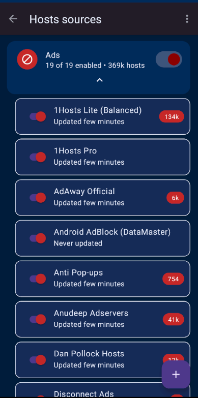
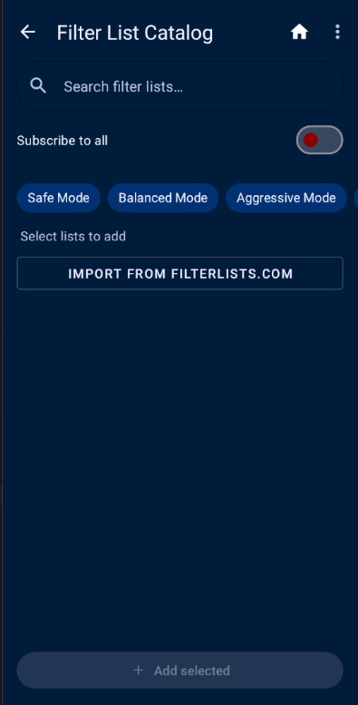

#  AdAway — Enhanced Fork

**AdAway** is an open-source ad blocker for Android using the hosts file (root mode) or a local VPN (non-root mode). This fork adds a modernized Material Design UI, a fully integrated FilterLists.com browser, one-tap onboarding, and advanced filter scheduling.

[](https://github.com/AdAway/AdAway/actions/workflows/android-ci.yml)
[](https://sonarcloud.io/project/overview?id=org.adaway)
[](https://github.com/stevesolun/AdAway/releases)
[](/LICENSE.md)

---

## What's New in This Fork (v13.1.0)

### Modern Bottom Navigation UI

Three clean tabs replace the old navigation drawer:

| **Home** | **Discover** | **More** |
|:---:|:---:|:---:|
|  |  |  |
| Status at a glance, one-tap toggle | Browse & subscribe FilterLists.com | Tools, settings, about |

- **Home** — Protection status, stats (domains blocked, sources active), update button, live progress during updates.
- **Discover** — Integrated FilterLists.com browser with search, tag chips, language filter, and quick-start presets (Safe / Balanced / Aggressive).
- **More** — DNS Log, Custom Rules, Filter Sources, Adware Scanner, Preferences, Backup & Restore, About, GitHub.

### One-Tap Onboarding

First launch auto-detects root/VPN capability, subscribes default filter lists in the background, and drops you straight into the app — no multi-screen wizard.

---

## Features

### Filter Management
- **Categorized filter lists** — Sources organized with per-category enable/disable.
- **Catalog browsing** — Curated catalog with Safe / Balanced / Aggressive / Custom modes, search, and "already added" indicators.
- **FilterLists.com integration** — Browse all 5000+ community lists, filter by tag and language, subscribe with one tap.
- **Quick-start presets** — Subscribe a curated Safe, Balanced, or Aggressive set with a single chip tap on the Discover screen.
- **Custom lists** — Add any URL, choose format (Hosts / Domains / Adblock / Allowlist / Redirect).
- **Per-list update** — Update a single list or all enabled sources.

### Performance (v13.0+)
- Hardware-adaptive parallelism (auto-detects CPU cores and memory).
- Parallel check → download → parse pipeline with overlapping phases.
- Global host deduplication (same host from multiple sources stored once).
- Conditional GET (`If-None-Match` / `If-Modified-Since`) to skip unchanged sources.
- Aggressive DB batching (5000 entries per batch).
- Larger OkHttp connection pool with dispatcher tuning.
- Monotonic progress display (percentages never go backwards).

### Background Operations
- Subscribe-all runs as a foreground WorkManager job with a notification.
- Live progress bar on Home during long operations — leave the app and come back.

### Filter Sets & Scheduling
- Save/apply named filter sets.
- Schedule automatic updates: daily at a chosen time, weekly on a chosen day + time.
- Schedule manager: **Hosts sources → menu → Manage schedules**.

### Smart Toggle & Batch Import
- Toggle a downloaded block rule → seamlessly creates an Allow override.
- Paste multiple domains (newline-separated) to add to Blocked or Allowed lists at once.

---

## Installing

### Download APK (Quickest)

1. Go to [**Releases**](https://github.com/stevesolun/AdAway/releases/latest).
2. Download `app-release.apk`.
3. **If you have the official AdAway installed**, uninstall it first (different signing key).
4. Open the APK on your Android device.
   - If prompted: allow **Install unknown apps** for your file manager / browser.
5. Open AdAway and complete the one-tap onboarding.

> **Note**: This build is signed with a debug key. Android prevents updating over the official AdAway app due to signature mismatch — uninstalling the old app first resolves this.

### Requirements
- Android 8.0 (API 26) or later
- For root mode: a rooted device with `su` access
- For VPN mode: no root needed

---

## Building from Source

### Prerequisites

| Tool | Version |
|------|---------|
| Android Studio | Hedgehog or later |
| Android SDK | API 34 |
| Android NDK | 27.2.12479018 |
| JDK | 21 |

### Clone and Build

```bash
git clone https://github.com/stevesolun/AdAway.git
cd AdAway

# Debug build (for development)
./gradlew assembleDebug

# Release build (debug-signed, installable)
./gradlew assembleRelease -x lintVitalAnalyzeRelease -x lintVitalReportRelease -x lintVitalRelease

# Run unit tests
./gradlew testDebugUnitTest

# Install directly to connected device/emulator
./gradlew installDebug
```

Output APKs:
- Debug: `app/build/outputs/apk/debug/app-debug.apk`
- Release: `app/build/outputs/apk/release/app-release.apk`

### Production Signing (Optional)

Add to `~/.gradle/gradle.properties`:

```properties
signingStoreLocation=/path/to/keystore.jks
signingStorePassword=your_store_password
signingKeyAlias=your_key_alias
signingKeyPassword=your_key_password
```

### CI/CD — Automatic APK Releases

Push a tag like `v13.1.0` to trigger:
1. GitHub Actions builds `assembleRelease`.
2. A GitHub Release is created with the APK attached.
3. Older releases are pruned (keeps latest 3).

Add these repository secrets for production-signed APKs:
- `ANDROID_KEYSTORE_BASE64`
- `ANDROID_KEYSTORE_PASSWORD`
- `ANDROID_KEY_ALIAS`
- `ANDROID_KEY_PASSWORD`

---

## Architecture

```
app/src/main/java/org/adaway/
├── ui/
│   ├── home/           # HomeActivity (nav shell) + HomeFragment + HomeViewModel
│   ├── discover/       # DiscoverFragment → DiscoverFilterListsFragment + DiscoverCatalogFragment
│   ├── more/           # MoreFragment (tools & settings menu)
│   ├── onboarding/     # OnboardingActivity (single-screen first-run)
│   ├── lists/          # Custom allow/block rules (ListsActivity)
│   ├── hosts/          # Filter sources management (HostsSourcesActivity)
│   └── log/            # DNS query log (LogActivity)
├── model/
│   └── source/         # SourceModel, SourceLoader, FilterListCatalog, FilterSetStore
├── db/                 # Room database: HostsSource, HostListItem, HostEntry
├── util/               # AppExecutors (diskIO / networkIO / mainThread)
└── vpn/                # Local VPN + DNS proxy (non-root mode)

tcpdump/                # Native packet capture (C, NDK)
webserver/              # Native HTTP server — mongoose (C, NDK)
```

**Navigation**: `HomeActivity` is a thin `BottomNavigationView` shell. All UI logic lives in fragments. Fragments share data via `HomeViewModel` scoped to the Activity.

**Threading**:
- `diskIO()` — Room DB reads/writes (single-threaded by design).
- `networkIO()` — HTTP calls via OkHttp. Never mix HTTP on `diskIO()`.
- `mainThread()` — UI updates only.
- `WorkManager` — Long-running background jobs (subscribe-all).

**Database**: Room v7 over SQLite in WAL mode. Schema migrations are serious — always create a migration file.

---

## FilterLists.com API

The Discover tab integrates the FilterLists.com public API:

| Endpoint | Used for |
|----------|----------|
| `GET /lists` | Browse all filter lists (with tagIds, languageIds) |
| `GET /tags` | Filter chip labels (41 tags, cached 24h) |
| `GET /languages` | Language spinner (81 languages, cached 24h) |
| `GET /lists/{id}` | Subscription URL for a specific list |

Responses are cached in `SharedPreferences` with a 24-hour TTL to avoid hammering the API.

---

## Permissions

| Permission | Purpose |
|------------|---------|
| `INTERNET` | Download filter lists, FilterLists.com API |
| `RECEIVE_BOOT_COMPLETED` | Restart VPN / hosts protection on reboot |
| `FOREGROUND_SERVICE` | Background subscribe-all worker notification |
| `POST_NOTIFICATIONS` | Update completion notifications (Android 13+) |
| `QUERY_ALL_PACKAGES` | Adware scanner — list installed apps |
| `BIND_VPN_SERVICE` | Local VPN mode (non-root) |

Root mode additionally requires `su` access to write to `/etc/hosts`.

---

## How-To Guides

### Set Up Protection (First Time)

1. Open the app — the onboarding screen appears.
2. The app auto-detects whether your device is rooted.
   - Rooted: **Root mode** is pre-selected (writes `/etc/hosts`).
   - Non-root: **VPN mode** is pre-selected (local DNS proxy).
3. Tap **Start protecting** — default filter lists subscribe in the background.
4. You land on the Home screen. Protection is active.

### Add a Filter List from FilterLists.com

1. Tap the **Discover** tab.
2. Use the search box or filter by tag / language.
3. Tap a list to see its description and subscription URL.
4. Tap **Subscribe** — the list is added and enabled.

### Apply a Quick-Start Preset

1. Tap the **Discover** tab.
2. At the top, tap **Safe**, **Balanced**, or **Aggressive**.
   - **Safe**: AdAway defaults + StevenBlack unified (ads only).
   - **Balanced**: + privacy lists (tracking, analytics).
   - **Aggressive**: + social trackers, malware, phishing.
3. A snackbar confirms how many lists were added.
4. Go to Home and tap **Update** to apply.

### Update Filter Lists

- Tap **Update** on the Home screen to refresh all enabled sources.
- Or go to **More → Filter Sources**, long-press a source, and tap **Update**.

### Add a Custom Filter List

1. Go to **More → Filter Sources**.
2. Tap the **+** button.
3. Enter the list URL and select the format.
4. Tap **Add**. Enable it and tap **Update** on Home.

### Block / Allow a Specific Domain

1. Go to **More → Custom Rules**.
2. Tap **+** and choose **Block** or **Allow**.
3. Enter the domain (e.g. `ads.example.com`).
4. Tap **Save**. Changes apply immediately without updating.

### Batch Import Domains

1. Go to **More → Custom Rules**.
2. Tap **⋮ → Batch Import**.
3. Paste your list of domains, one per line.
4. Choose **Block** or **Allow** and confirm.

### View DNS Query Log

1. Go to **More → DNS Log**.
2. See real-time DNS queries. Blocked queries are marked in red.
3. Tap a query to add it as a custom Allow or Block rule.

### Schedule Automatic Updates

1. Go to **More → Filter Sources**.
2. Tap **⋮ → Manage schedules**.
3. Set a daily or weekly schedule.
4. The app updates filter lists in the background at the scheduled time.

### Backup & Restore

1. Go to **More → Backup & Restore** (via Preferences).
2. **Backup**: exports your filter sources, custom rules, and settings.
3. **Restore**: imports from a backup file.

---

## Troubleshooting

| Symptom | Fix |
|---------|-----|
| Ads not blocked | Tap **Update** on Home to refresh filter lists. |
| VPN disconnects | Check **More → Preferences → VPN** settings. |
| App crashes on subscribe | Clear app data and re-onboard. |
| "Install unknown apps" blocked | Enable in Android Settings → Apps → Special app access. |
| Can't install over official AdAway | Uninstall the official AdAway first (different signing key). |
| Filter list not updating | Check network, then try **More → Filter Sources → Update single list**. |

---

## Contributing

See [CONTRIBUTING.md](CONTRIBUTING.md) for guidelines.

- Bug reports: [GitHub Issues](https://github.com/AdAway/AdAway/issues) (upstream) or [this fork's issues](https://github.com/stevesolun/AdAway/issues).
- Pull requests welcome — keep commits atomic and focused.
- Code style: Java 17, 4-space indent, 100-char line width, non-public fields prefixed `m`.

---

## License

[GPL v3](/LICENSE.md) — same as the upstream AdAway project.

---

## Upstream

This is a fork of [AdAway/AdAway](https://github.com/AdAway/AdAway). All original credits go to the AdAway team and contributors.
