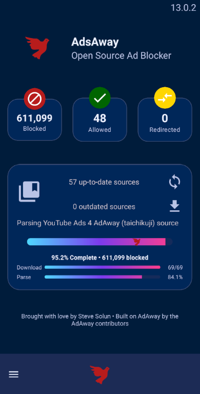

#  AdsAway
======
**AdsAway** is an open source ad blocker for Android using the hosts file.

### New Material Design UI
| Home Screen (Deep Red/Navy) | FilterLists Import (Sub-All Restored) |
|:---:|:---:|
|  |  |
 and local vpn.

 

For more information visit https://adaway.org

## Filter management

This fork adds an enhanced filter management experience:

- **Categorized filter lists**: Sources are organized into expandable categories (Ads, Malware, Privacy, Social, Regional, Custom, etc.) with per-category enable/disable.
- **Catalog browsing**: A curated catalog with **Safe/Balanced/Aggressive/Custom** selection modes, search, and “already added” indicators.
- **Custom lists**: Add your own list URL and choose a preferred list format (Hosts / Domains / Adblock rules best-effort / Allowlist / Redirect).
- **Per-list update**: Update a single list from the sources screen when an update is available, or update all enabled sources.
- **FilterLists.com integration**: Browse/import lists from FilterLists and run **Subscribe to all** in the background.
- **Background progress + notifications**: “Subscribe to all” runs in the background (foreground worker notification) and posts a completion notification; you can leave the screen/app and come back later.
- **Progress on Home**: Live progress text + bar on the Home screen during long-running operations (subscribe-all + updates). Overall percentage is monotonic (won’t go backwards).
- **Filter sets + scheduling**: Save/apply “filter sets” and schedule automatic updates for:
  - the current active set, or any saved set
  - individual sources
  - daily at a chosen time
  - weekly on a chosen day + time
- **Schedule manager**: Manage global + filter-set + per-source schedules from **Hosts sources → menu → Manage schedules**, or from the **+** button sheet.
- **Update performance improvements** (v13.0):
  - Hardware-adaptive parallelism (auto-detects CPU cores and memory)
  - Parallel check + download + parse pipeline (overlapping phases)
  - Global host deduplication (same host from multiple sources stored only once)
  - Larger OkHttp connection pool with dispatcher tuning
  - Aggressive batching for DB inserts (5000 entries per batch)
  - Conditional GET (`If-None-Match` / `If-Modified-Since`) to skip unchanged sources
  - Monotonic progress display (percentages never decrease)

## Installing

### Install this fork (download APK)

1. **Download**: Get the latest `app-release.apk` from [Releases](https://github.com/stevesolun/AdAway/releases/latest).
2. **Uninstall**: If you have an existing AdAway app, **you must uninstall it first** (this fork uses a different signing key).
3. **Install**: Open the APK file on your Android device.
   - If prompted, allow "Install unknown apps".
   - You should see the "AdAway" installation dialog.
4. **Verify**: Open AdAway and confirm the version on the Home screen.

> **Note**: This is a test build signed with a debug key. Android will block updates over the official app due to signature mismatch. Uninstalling the old app solves this.

### CI/CD (automatic APK releases)

This repo includes a GitHub Actions workflow that publishes a Release whenever you push a tag like `v13.0.1`.

- **Tag + release**: push `v*` tags → builds `assembleRelease` → creates a GitHub Release with the APK attached.
- **Cleanup**: automatically deletes older releases (keeps the latest 3).
- **Security**: The build falls back to a debug signing key if no release secrets are provided, ensuring the APK is always installable (v2+ signature).

To publish **production-signed** APKs (for Play Store/F-Droid), add these repository secrets:

- `ANDROID_KEYSTORE_BASE64` (base64 of your `.jks`)
- `ANDROID_KEYSTORE_PASSWORD`
- `ANDROID_KEY_ALIAS`
- `ANDROID_KEY_PASSWORD`
