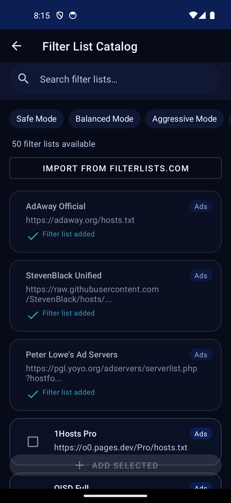
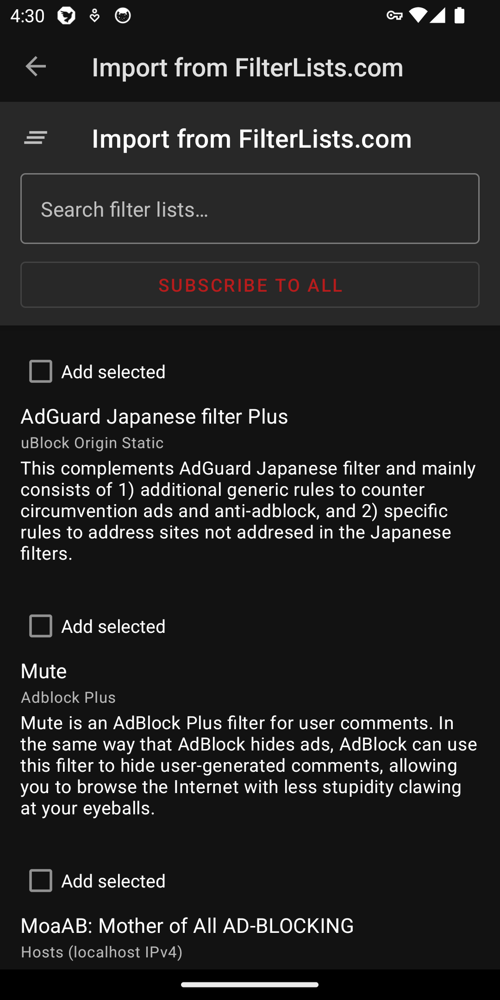
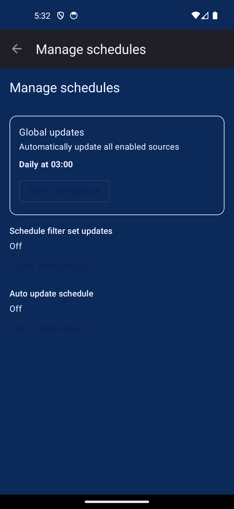
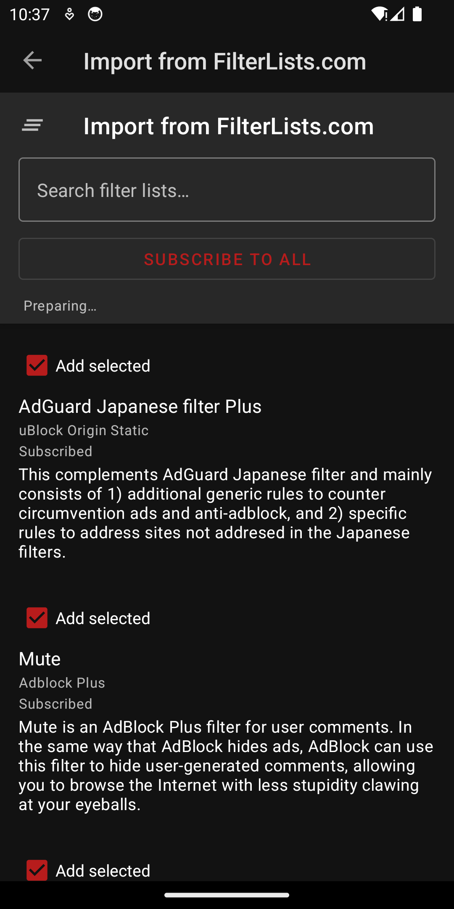

#  AdAway

 

AdAway is an open source ad blocker for Android using the hosts file and local vpn.

For more information visit https://adaway.org

## Filter management

This fork adds an enhanced filter management experience:

- **Categorized filter lists**: Sources are organized into expandable categories (Ads, Malware, Privacy, Social, Regional, Custom, etc.) with per-category enable/disable.
- **Catalog browsing**: A curated catalog with **Safe/Balanced/Aggressive/Custom** selection modes, search, and “already added” indicators.
- **Custom lists**: Add your own list URL and choose a preferred list format (Hosts / Domains / Adblock rules best-effort / Allowlist / Redirect).
- **Per-list update**: Update a single list from the sources screen when an update is available, or update all enabled sources.
- **FilterLists.com integration**: Browse/import lists from FilterLists and run **Subscribe to all** in the background.
- **Background progress + notifications**: “Subscribe to all” runs in the background (foreground worker notification) and posts a completion notification; you can leave the screen/app and come back later.
- **Progress on Home**: Live progress text + bar on the Home screen during long-running operations (subscribe-all + updates). Overall percentage is monotonic (won’t go backwards).
- **Filter sets + scheduling**: Save/apply “filter sets” and schedule automatic updates for:
  - the current active set, or any saved set
  - individual sources
  - daily at a chosen time
  - weekly on a chosen day + time
- **Schedule manager**: Manage global + filter-set + per-source schedules from **Hosts sources → menu → Manage schedules**, or from the **+** button sheet.
- **Update performance improvements** (v13.0):
  - Hardware-adaptive parallelism (auto-detects CPU cores and memory)
  - Parallel check + download + parse pipeline (overlapping phases)
  - Global host deduplication (same host from multiple sources stored only once)
  - Larger OkHttp connection pool with dispatcher tuning
  - Aggressive batching for DB inserts (5000 entries per batch)
  - Conditional GET (`If-None-Match` / `If-Modified-Since`) to skip unchanged sources
  - Monotonic progress display (percentages never decrease)

## Installing

### Install this fork (download APK)

- Download the latest APK from [Releases (latest)](https://github.com/stevesolun/AdAway/releases/latest).
  - Prefer **`app-release.apk`** (signed). If you only see **`app-release-unsigned.apk`**, signing secrets are not configured yet (see CI/CD notes below).
- On Android: open the downloaded APK and allow **Install unknown apps** when prompted.
  - If you see an error like “App not installed” / “Signature conflict”, uninstall the previous `org.adaway` app first, then install the APK again.
- Verify it installed: open AdAway and confirm the version shown on the Home screen (top-right).

### CI/CD (automatic APK releases)

This repo includes a GitHub Actions workflow that publishes a Release whenever you push a tag like `v13.0.1`.

- **Tag + release**: push `v*` tags → builds `assembleRelease` → creates a GitHub Release with the APK attached
- **Cleanup**: automatically deletes older releases (keeps the latest 3), and can be triggered manually via **Actions → “Cleanup old releases”**

To publish **signed** APKs (recommended), add these repository secrets:

- `ANDROID_KEYSTORE_BASE64` (base64 of your `.jks`)
- `ANDROID_KEYSTORE_PASSWORD`
- `ANDROID_KEY_ALIAS`
- `ANDROID_KEY_PASSWORD`
