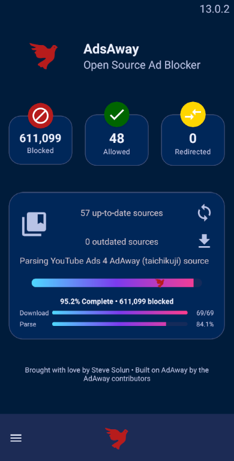
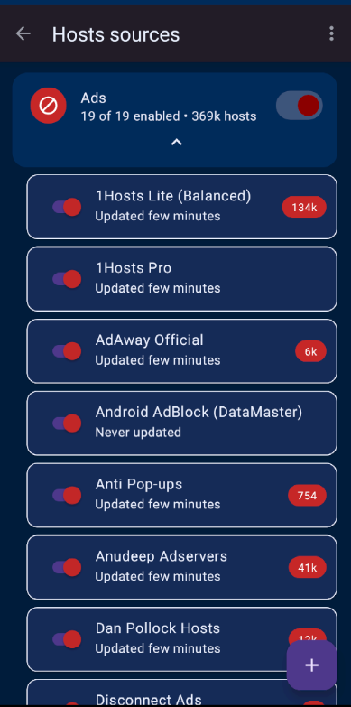
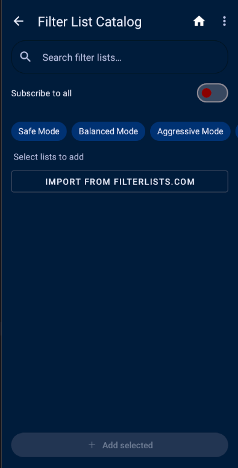

#  AdAway

**AdAway** is an open-source, system-level ad blocker for Android. It uses the hosts file (root mode) or a local VPN (non-root mode) to block ads, trackers, malware, and unwanted domains network-wide — across every app and browser.

AdAway ships with a modernized Material 3 UI, deep FilterLists.com integration,
categorized filter management, and one-tap onboarding.

[](https://github.com/stevesolun/AdAway/releases)
[](/LICENSE.md)

---

## Table of Contents

1. [What's New](#whats-new)
2. [Features](#features)
3. [Screenshots](#screenshots)
4. [Installing](#installing)
5. [Architecture](#architecture)
6. [Filter Categories](#filter-categories)
7. [Building from Source](#building-from-source)
8. [How-To Guides](#how-to-guides)
9. [Permissions](#permissions)
10. [Troubleshooting](#troubleshooting)
11. [Contributing](#contributing)
12. [License](#license)

---

## What's New

| Version | Highlight |
|---------|-----------|
| **v13.4.9** | Runtime-truth, crash-safety, and release-gate hardening |
| v13.4.8 | Fix literal `"null"` description in FilterLists.com Discover tab |
| v13.4.6 | ATK-29b: dotless-i / dotted-I Unicode injection bypass closed |
| v13.4.2 | Security hardening: 22 attack vectors fixed (SSRF, MitM CA pin, backup limits, etc.) |
| v13.3.x | Reliability: NPE/race/threading fixes, Force English locale, download error feedback |
| v13.0–v13.2 | Parallel pipeline, Conditional GET, WAL mode, FilterLists.com browser, presets |

---

## Features

### Blocking Modes

| Mode | How it works | Root needed? |
|------|-------------|:------------:|
| **Root** | Writes to `/etc/hosts` — blocks at kernel level | ✅ Yes |
| **VPN** | Runs a local DNS proxy via Android VPN API | ❌ No |

Both modes block at the DNS level — no content injection, no HTTPS inspection.

### Filter Management

- **12 filter categories** — ADS, YOUTUBE, PRIVACY, MALWARE, CRYPTO, SOCIAL, DEVICE, SERVICE, ANNOYANCES, REGIONAL, USER, CUSTOM
- **Quick-start presets** — Safe / Balanced / Aggressive chip taps on Discover
- **FilterLists.com browser** — 5000+ community lists, search by name, tag, or language
- **Categorized source view** — sources grouped and color-coded by category
- **Custom lists** — compatible DNS-oriented lists with explicit hosts, domains, allowlist, or redirect rules
- **One-tap subscribe / unsubscribe** from FilterLists.com directory
- **Filter Sets** — save named presets, apply with one tap
- **Scheduled updates** — daily or weekly automatic list refresh

### Performance

- Parallel download + parse pipeline using all available CPU cores
- Conditional GET skips re-downloading unchanged lists (ETag / Last-Modified)
- Batch DB inserts (5000 hosts per transaction)
- WAL mode — reads never block writes
- Global host deduplication — same host from multiple sources stored once
- OkHttp connection pool tuning — larger pool, more parallel connections

### Safety

- WaTg Safety Allowlist — wildcards for `*.whatsapp.com`, `*.whatsapp.net`, `*.fbcdn.net`, `*.facebook.com`, `*.telegram.org`, `*.telegram.me`, `*.t.me` prevent blocking WhatsApp and Telegram
- SOCIAL / DEVICE categories flagged as "may break services" — shown with warnings in UI
- Download errors persisted per-source — visible in the source card without re-downloading

---

## Screenshots

| **Home** | **Discover** | **More** |
|:---:|:---:|:---:|
|  |  |  |
| Status, stats, one-tap toggle | Browse & subscribe FilterLists.com | Tools, settings, about |

---

## Installing

### Download APK (Quickest)

1. Go to [**Releases**](https://github.com/stevesolun/AdAway/releases/latest).
2. Download the latest `AdAway_<version>.apk` asset.
3. **If you have the official AdAway installed**, uninstall it first — different signing key.
4. Open the APK on your device → allow "Install unknown apps" if prompted.
5. Open AdAway and complete one-tap onboarding.

### Requirements

- Android 8.0 (API 26) or later
- Root mode: rooted device with `su` binary
- VPN mode: no root needed

> **Note**: CI debug artifacts are signed with a debug key. Tagged GitHub
> releases must be production-signed and pass APK hash, package, version, and
> signing-certificate verification before upload. Android prevents updating over
> the official AdAway when signing keys differ. Uninstall first.

---

## Architecture

### Module Structure

```
AdAway/
|-- app/                    # Android application (Java 17)
|-- sentrystub/             # Sentry stub for release builds
`-- tcpdump/                # Source-only native packet-capture history; not packaged
```

Current Gradle builds include `:app` and `:sentrystub`; tcpdump is source-only for APK
purposes, and the historical local webserver is absent from the current build. The runtime
critical path is the Android app database, parser, root hosts writer, and VPN DNS proxy.

### App Source Layout

```
app/src/main/java/org/adaway/
├── broadcast/
│   ├── BootReceiver.java          # Restart protection on reboot
│   ├── UpdateReceiver.java        # Trigger source updates externally
│   └── Command.java               # Broadcast command enum
├── db/
│   ├── dao/                       # HostsSourceDao, HostListItemDao, HostEntryDao
│   ├── entity/                    # HostsSource, HostListItem, HostEntry, HostsMeta
│   └── AppDatabase.java           # Room DB (WAL mode, v11, 10 migrations)
├── model/
│   ├── source/
│   │   ├── SourceModel.java           # Download → Parse → Insert pipeline
│   │   ├── SourceLoader.java          # Parser (hosts/domains/adblock formats)
│   │   ├── FilterListCatalog.java     # 60+ curated lists across 12 categories
│   │   ├── FilterListCategory.java    # Category enum (ADS/PRIVACY/MALWARE/…)
│   │   └── FilterSetStore.java        # Named presets + scheduling
│   ├── adblocking/                # Root/VPN switching logic
│   ├── backup/                    # Backup/restore (JSON format)
│   ├── git/                       # GitHub/GitLab/Gist source types
│   └── update/                    # APK self-update check
├── ui/
│   ├── home/                      # HomeActivity (nav shell) + HomeFragment + ViewModel
│   ├── discover/                  # FilterLists.com browser + catalog presets
│   ├── more/                      # Tools & settings navigation
│   ├── onboarding/                # First-run single-screen wizard
│   ├── lists/                     # Custom blocked/allowed/redirected rules
│   ├── hosts/                     # Filter sources management (HostsSourcesActivity)
│   ├── prefs/                     # Preferences screens
│   ├── adware/                    # Installed app adware scanner
│   ├── log/                       # Real-time DNS query log
│   └── domainchecker/             # Manual domain lookup tool
├── util/
│   └── AppExecutors.java          # diskIO / networkIO / mainThread pools
└── vpn/                           # Local VPN + DNS proxy (non-root mode)
    ├── dns/                       # DnsPacketProxy, DnsQuery, DnsQueryQueue
    └── worker/                    # VpnWorker, watchdog, throttler
```

### Threading Model

```
diskIO()     → Single-threaded executor — Room DB reads/writes
networkIO()  → Fixed-size pool — OkHttp HTTP calls (NEVER mix with diskIO)
mainThread() → Android main looper — UI updates only
WorkManager  → Long-running background jobs (subscribe-all, scheduled updates)
```

**Rule**: Network on `networkIO()`. DB on `diskIO()`. UI on `mainThread()`. Never cross streams.

### Database Schema (Room v11, SQLite WAL)

```
hosts_sources
  id, label, url, enabled, type, entityTag, last_modified_online,
  last_download_error, category, generation

hosts_lists
  id, host, type (0=block/1=allow/2=redirect), source_id, generation

hosts_meta
  id (single row), current_generation

host_entries
  id, host, type, redirect_target (runtime resolved entries for VPN)
```

**Generation system**: Each update cycle bumps the generation counter. Entries from the previous generation are cleaned up after the new generation is fully written — prevents partial state.

**HTTP 304 handling (v13.3.3 fix)**: When a server returns 304 Not Modified, existing entries are migrated from generation G → G+1 *before* cleanup runs, so nothing is deleted.

## Filter Categories

| Category | Safe? | Default On | Description |
|----------|:-----:|:----------:|-------------|
| **ADS** | ✅ Safe | ✅ Yes | Advertisement servers — rarely breaks anything |
| **MALWARE** | ✅ Safe | ✅ Yes | Malware, phishing, ransomware domains |
| **YOUTUBE** | ✅ Safe | ❌ No | YouTube in-stream ad servers |
| **PRIVACY** | ✅ Safe | ❌ No | Trackers, analytics, fingerprinting |
| **CRYPTO** | ✅ Safe | ❌ No | Browser-based cryptocurrency mining |
| **ANNOYANCES** | ✅ Safe | ❌ No | Cookie banners, popup overlays |
| **REGIONAL** | ✅ Safe | ❌ No | Region-specific ad networks |
| **SERVICE** | ⚠️ Moderate | ❌ No | In-app ads (Spotify, etc.) — may break those apps |
| **SOCIAL** | 🔴 Aggressive | ❌ No | Social media trackers — **may break Facebook/Instagram/WhatsApp** |
| **DEVICE** | 🔴 Aggressive | ❌ No | OEM telemetry (Samsung/Xiaomi) — **may break OEM features** |
| **USER** | — | — | Your personal blocked/allowed/redirected rules |
| **CUSTOM** | — | — | Custom sources added via URL |

### Quick-Start Presets

| Preset | Categories Included |
|--------|-------------------|
| **Safe** | ADS + MALWARE |
| **Balanced** | ADS + MALWARE + PRIVACY + YOUTUBE |
| **Aggressive** | ADS + MALWARE + PRIVACY + YOUTUBE + CRYPTO + ANNOYANCES + REGIONAL |

---

## Building from Source

### Prerequisites

| Tool | Required Version |
|------|-----------------|
| Android Studio | Hedgehog (2023.1) or later |
| Android SDK | API 36 |
| Android Build Tools | 36.0.0 |
| Android NDK | **27.2.12479018** (exact - C native code) |
| JDK | 21 |
| Git | Any recent version |

### Clone and Build

```bash
git clone https://github.com/stevesolun/AdAway.git
cd AdAway

# Debug build (for development + testing)
./gradlew assembleDebug

# Direct-download release build
./gradlew :app:assembleDirectRelease --dependency-verification=strict

# Run unit tests
./gradlew testDebugUnitTest

# Install directly to connected device or emulator
./gradlew installDebug
```

**Output APKs:**
- Debug: `app/build/outputs/apk/debug/app-debug.apk`
- Direct release: `app/build/outputs/apk/directRelease/app-directRelease.apk`

### UX Matrix Review Packet

For pre-release UI review, run the connected UX matrix on an emulator:

```powershell
powershell -NoProfile -ExecutionPolicy Bypass -File .\scripts\run-ux-matrix.ps1 `
  -OutputDir app\build\reports\ux-matrix
```

The runner covers baseline, 1.3/1.6 font scales, and RTL pseudo-locale variants.
It pulls screenshots for the key app shells and writes
`app/build/reports/ux-matrix/ux-matrix-review.md`, a checklist packet for manual
review of clipping, overlap, touch targets, RTL anchoring, FAB clearance, and the
AdAway bird brand signal. The packet includes `Source commit`, binding the
screenshots and checklist to the source revision that generated them.

After the reviewer marks every checklist item in `ux-matrix-review.md` as
complete, verify the sign-off packet and write a durable report:

```powershell
powershell -NoProfile -ExecutionPolicy Bypass -File .\scripts\verify-ux-signoff.ps1 `
  -ReviewPacket app\build\reports\ux-matrix\ux-matrix-review.md `
  -Reviewer "<name>" `
  -ReportPath app\build\reports\ux-matrix\ux-signoff-report.md
```

For CI-backed UX sign-off, run the manual
`.github/workflows/verify-ux-signoff.yml` workflow with `review_packet_base64`,
the base64-encoded checked `ux-matrix-review.md`, and the reviewer identity.
Successful runs upload a `ux-signoff-report` artifact with the current source
commit and the checked packet's source commit; stale packets from another
source revision are rejected.

After release artifact verification, physical release smoke, UX sign-off, and
license-boundary checks have all produced reports, aggregate them into one final
readiness report:

```powershell
powershell -NoProfile -ExecutionPolicy Bypass -File .\scripts\verify-release-readiness.ps1 `
  -ReleaseArtifactReport release-artifacts\verification-report.md `
  -PhysicalSmokeReport release-smoke\release-smoke-report.md `
  -UxSignOffReport app\build\reports\ux-matrix\ux-signoff-report.md `
  -UxReviewPacket app\build\reports\ux-matrix\ux-matrix-review.md `
  -LicenseBoundaryReport app\build\reports\license-boundary\license-boundary-report.md `
  -ReportPath release-readiness-report.md
```

The readiness verifier requires all proof reports to describe the same source commit.
It also requires the artifact verifier and physical smoke report to
describe the same release tag, APK name, APK SHA-256, and signing certificate
digest; do not combine proof reports from different release attempts. The
release artifact report must come from `verify-release-artifacts` and include
`Source commit`,
`Checksum verification: passed`, `Manifest signature: passed`,
`Manifest payload: passed`, and a checked `Expected certificate SHA-256`.
The physical smoke report must come from `run-release-smoke.ps1` in
physical-device mode and include `Release tag`, `Package`,
`Signer certificate check: True`, `Signer certificate SHA-256`,
`Device serial SHA-256`, `Launch pid observed`, and `Source commit`.
Use the tagged release artifact license-boundary report for
`-LicenseBoundaryReport`; it must show `Strict artifacts: true` with the same APK and SBOM
artifact names from the release artifact verification report, not the regular CI source-only
license-boundary report.
The UX sign-off report must come from `verify-ux-signoff.ps1` and include a
reviewer, review packet, `Source commit`, `Review packet source commit`,
`Review packet SHA-256`, checked item count, `Unchecked items: 0`, and
`Issues: 0`; do not use hand-written pass markers.
When `-UxReviewPacket` is provided, final readiness also hashes the checked
review packet and requires the same review packet hash as the sign-off report.
The generated `release-readiness-report.md` repeats the release tag, APK, APK
SHA-256, SBOM, source commit, and UX review packet hash, then records
`Release artifact report SHA-256`, `Physical smoke report SHA-256`,
`UX sign-off report SHA-256`, and `License boundary report SHA-256` so the final
summary is tied to the exact proof reports it consumed.

For CI-backed final aggregation, run the manual
`.github/workflows/verify-release-readiness.yml` workflow after the post-publish
artifact verifier, physical release smoke, UX sign-off, and release
license-boundary reports exist. Provide the run IDs for
`release-artifact-verification-report`, `physical-release-smoke-report`, and
`release-license-boundary-reports`, plus `ux_signoff_run_id`, the run that
uploaded the generated `ux-signoff-report` and checked `ux-matrix-review.md`.
Successful runs upload a `release-readiness-report` artifact.

### Production Signing

Add to `~/.gradle/gradle.properties`:

```properties
signingStoreLocation=/path/to/keystore.jks
signingStorePassword=your_store_password
signingKeyAlias=your_key_alias
signingKeyPassword=your_key_password
updateManifestPublicKeyBase64=base64_encoded_spki_public_key
```

### CI/CD — Automatic Releases

Push a signed version tag to trigger the release pipeline:

```bash
git tag -s v<version> -m "AdAway <version>"
git verify-tag v<version>
git push origin v<version>
```

GitHub Actions (`.github/workflows/fork-release-apk.yml`) will:
1. Verify the signed release tag with `RELEASE_TAG_PUBLIC_KEY_BASE64`
2. Build `assembleDirectRelease`
3. Rename the APK to `AdAway_<version>.apk`
4. Verify the APK package name, tag-matching version, signer SHA-256, and file SHA-256
5. Generate the signed update manifest
6. Generate the CycloneDX SBOM and SHA-256 checksum files
7. Attest the APK, manifest, SBOM, and their `.sha256` checksum sidecars
8. Verify those GitHub attestations with the canonical artifact verifier
9. Create a GitHub Release with the APK, manifest, checksums, and SBOM attached

Before announcing a release, run the `RELEASING.md` artifact verifier and
release smoke. Full smoke requires an attached physical device. After the
release is created, run the manual `verify-release-artifacts.yml` workflow as
the CI-backed post-publish artifact and attestation check; successful runs
upload a `release-artifact-verification-report` artifact. For install/launch
coverage, run `physical-release-smoke.yml` on a self-hosted runner labeled
`android-device`; it downloads the tagged APK and runs the full release smoke
against a physical device. Successful physical smoke runs upload a
`physical-release-smoke-report` artifact with release tag, APK name, APK
SHA-256, signer certificate identity, and the observed launch result. Regular
CI also uploads a `license-boundary-report`; tagged direct-APK releases upload
`release-license-boundary-reports` covering source and packaged artifact
GPL/MIT boundary checks.
Run `verify-release-readiness.yml` last to download those proof artifacts,
download the generated UX sign-off report, run `verify-release-readiness.ps1`,
verify the same review packet hash, and upload the final
`release-readiness-report` artifact.

**Repository Secrets** (for production-signed APKs):

| Secret | Description |
|--------|-------------|
| `ANDROID_KEYSTORE_BASE64` | Base64-encoded keystore file |
| `ANDROID_KEYSTORE_PASSWORD` | Keystore password |
| `ANDROID_KEY_ALIAS` | Key alias |
| `ANDROID_KEY_PASSWORD` | Key password |
| `UPDATE_MANIFEST_PUBLIC_KEY_BASE64` | Base64 SPKI public key embedded for signed update-manifest verification |
| `UPDATE_MANIFEST_PRIVATE_KEY_BASE64` | Base64 PEM private key used to sign update manifests |
| `ANDROID_RELEASE_CERT_SHA256` | Expected release APK signing certificate SHA-256 digest |
| `RELEASE_TAG_PUBLIC_KEY_BASE64` | Base64 public key imported before `git verify-tag` |

Regular CI and CodeQL build debug artifacts. Production release builds are
expected to fail closed without the signing properties, signed-tag key, and
update-manifest trust material above.

### Key Dependencies

| Library | Version | Purpose |
|---------|---------|---------|
| OkHttp | 5.4.0 | HTTP downloads and update checks |
| Timber | 5.0.1 | Logging (no-op in release) |
| libsu | 6.0.0 | Root shell access |
| pcap4j | 1.8.2 | VPN packet capture/processing |
| dnsjava | 3.6.5 | DNS packet parsing |
| Guava | 33.6.0-android | Utilities |

## How-To Guides

### Set Up Protection (First Time)

1. Open the app — the onboarding screen appears.
2. Auto-detection checks root availability. If root is unavailable, VPN mode is pre-selected; rooted devices can choose Root mode or VPN mode.
3. Tap **Start protecting** — default filter lists subscribe in the background.
4. You land on Home. Protection is active.

### Add a Filter List from FilterLists.com

1. Tap the **Discover** tab.
2. Use the search box or filter by tag / language.
3. Tap a list → **Subscribe**.
4. The list is added and enabled. Tap **Update** on Home to apply.

### Apply a Quick-Start Preset

1. Tap the **Discover** tab.
2. Tap **Safe**, **Balanced**, or **Aggressive**.
3. A snackbar confirms how many lists were added.
4. Tap **Update** on Home to activate.

### Add a Custom Filter List

1. Go to **More → Filter Sources**.
2. Tap the **+** button.
3. Enter the list URL and select the format.
4. Tap **Add** → enable → tap **Update** on Home.

### Block / Allow a Specific Domain

1. Go to **More → Custom Rules**.
2. Tap **+** → choose **Block** or **Allow** → enter the domain.
3. Tap **Save**. Rules apply immediately (no update needed).

### Batch Import Domains

1. **More → Custom Rules → ⋮ → Batch Import**.
2. Paste domains, one per line.
3. Choose Block or Allow → confirm.

### View DNS Query Log (VPN mode only)

1. Go to **More → DNS Log**.
2. See real-time queries. Blocked = red, allowed = green.
3. Tap any entry → **Block** or **Allow** to add a custom rule.

### Schedule Automatic Updates

1. **More → Filter Sources → ⋮ → Manage schedules**.
2. Set daily (time) or weekly (day + time).
3. Updates run in the background at the scheduled time.

### Check If a Domain Is Blocked

**Option A — Domain Checker (no API key needed):**
1. **More → Domain Checker**.
2. Type any domain (or URL — port is stripped automatically).
3. Tap **Check** → see Blocked / Not blocked and which source blocked it.

### Backup & Restore

1. **More → Preferences → Backup & Restore**.
2. **Backup** — exports filter sources, custom rules, and settings as JSON.
3. **Restore** — imports from a backup file.

### Force English Locale

Some Android versions override language settings. To lock AdAway in English:
1. **More → Preferences → General → Force English**.
2. Force-stop and relaunch the app.

---

## FilterLists.com API

The Discover tab integrates the FilterLists.com public API:

| Endpoint | Used for |
|----------|----------|
| `GET /lists` | Browse all filter lists (with tagIds, languageIds, syntax) |
| `GET /tags` | Tag chip labels (41 tags, cached 24h in SharedPreferences) |
| `GET /languages` | Language spinner (81 languages, cached 24h) |
| `GET /lists/{id}` | Subscription URL for a specific list |

Responses are cached with a 24-hour TTL. No API key required.

---

## Permissions

| Permission | Purpose |
|------------|---------|
| `INTERNET` | Download filter lists, query FilterLists.com, and check updates |
| `RECEIVE_BOOT_COMPLETED` | Restart VPN / hosts protection on device reboot |
| `FOREGROUND_SERVICE` | Background subscribe-all worker notification |
| `POST_NOTIFICATIONS` | Update completion notifications (Android 13+) |
| Launcher package visibility query | Adware scanner — list launchable installed apps |
| `BIND_VPN_SERVICE` | Local VPN mode (non-root) |

Root mode additionally requires `su` access to write `/etc/hosts`.

---

## Troubleshooting

| Symptom | Fix |
|---------|-----|
| Ads not blocked | Tap **Update** on Home to refresh filter lists |
| VPN disconnects randomly | Check **More → Preferences → VPN** settings |
| WhatsApp stops working | Keep the built-in WaTg safety allowlist enabled; if a custom source still breaks messaging, use **Domain Checker** or **DNS Log** to add a targeted allow rule |
| Samsung Pay / OEM feature broken | Disable the **DEVICE** category |
| Filter list not updating | Check network; try **More → Filter Sources** and tap the source update icon |
| App crashes on subscribe | Clear app data and re-onboard |
| Can't install over official AdAway | Uninstall the official AdAway first (different signing key) |
| "Install unknown apps" blocked | Android Settings → Apps → Special app access → Install unknown apps |
| Domain Checker shows wrong result | Port numbers (e.g., `:8080`) are stripped automatically since v13.3.5 |
| Force English not working | Force-stop the app after toggling the setting |

---

## Contributing

- Bug reports: [this fork's issues](https://github.com/stevesolun/AdAway/issues)
- PRs welcome — keep commits atomic, present tense, explain *why* not *what*

**Code style:**
- Java 17 target
- 4-space indent, no tabs
- 100-char line width
- Non-public fields prefixed `m`
- Acronyms as words: `getUrl()` not `getURL()`

**Threading rules (mandatory):**
- DB operations: `AppExecutors.getInstance().diskIO()`
- HTTP calls: `AppExecutors.getInstance().networkIO()`
- UI: `AppExecutors.getInstance().mainThread()`
- Never call `AppExecutors.getInstance()` in a `static final` field initializer

**DB migrations:** Room v11. Any schema change requires a migration file in `db/migration/`. Test with `MigrationTest`.

---

## License

MIT relicensing is tracked as a future option only. The distributed app remains GPLv3+
until GPL-derived app/VPN code, assets, and third-party notice boundaries are cleared and
verified; see [docs/mit-relicensing-plan.md](docs/mit-relicensing-plan.md).

[GPL v3](/LICENSE.md) — same as the upstream AdAway project.

---

## Upstream & Credits

This is a fork of [AdAway/AdAway](https://github.com/AdAway/AdAway). All credit to the original AdAway team and contributors.

Crafted with love by Steve Solun · Forked from AdAway
